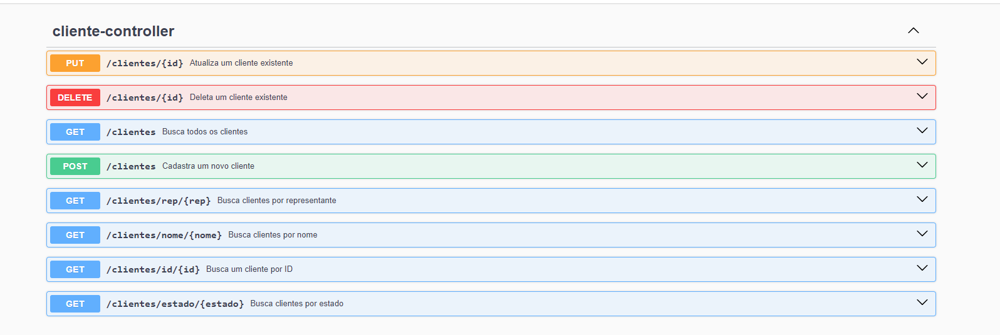

# Micro Serviço para Gerenciamento de Clientes.

### Tecnologias Utilizadas

- Java 17.
- Spring boot(3.3.2)
- Maven(4.0.0)
- Spring Data Jpa
- IDE utilizada: Spring Tools 4 para Eclipse. https://spring.io/tools
- Banco de dados em memória(H2) para fazer os testes de crud. (Caso desejar testar com outro banco, basta apenas configura-lo no .properties)

## Features

- Crud basico de clientes
- Buscar todos os clientes por estado, representante e também por nome(a pesquisa busca qualquer texto dentro do nome do cliente)

## Documentação da API

A documentação da API pode ser visualizada através da interface Swagger. Veja abaixo imagens da interface Swagger para ter uma visão geral dos endpoints disponíveis:

### Visão Geral da Documentação Swagger

### Para executar o projeto, basta copiar o o repositório, baixar as dependências do maven via spring boot, e aproveitar o projeto.

- Caso tenha interesse em ver a documentação detalhada, após rodar o projeto, acesse http://localhost:8080/swagger-ui.html para conferi-la.
